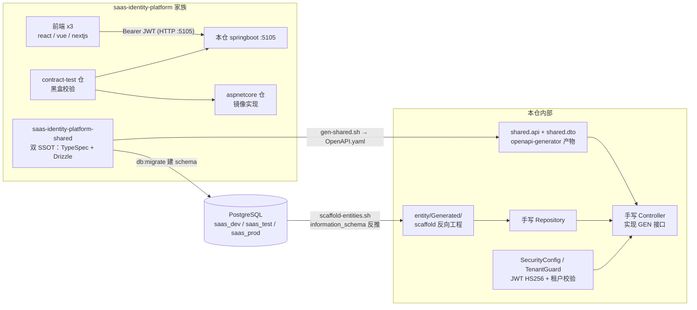
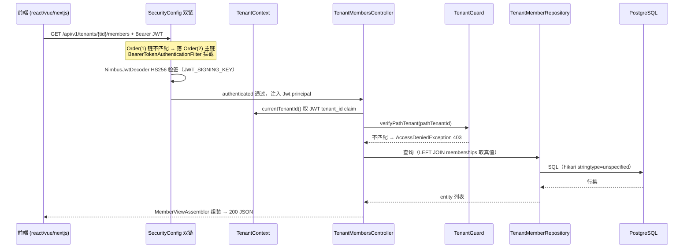

# saas-identity-platform-springboot 架构

> 一句话定位：saas-identity-platform 家族的 Java 后端实现——同一份产品契约下的两个真后端之一（另一个是 aspnetcore），Spring Boot 3.4 + PostgreSQL，Controller/DTO 全量由 shared 契约仓 codegen，手写业务逻辑与 Repository，被三个前端与 contract-test 黑盒消费。

生成日期：2026-09-22 ｜ 锚定 HEAD：634bdb6（634bdb6945dfdc512c36323786c7ac1cfe854042）｜ 生成方式：DeepWiki 风格架构扫描

## 1. 总览

- **家族角色**：后端仓（6 角色中的「后端」）。与 saas-identity-platform-aspnetcore 互为镜像实现，双方都必须通过 contract-test 仓的黑盒校验，保证「前端不可区分」。本仓另有书稿配套仓身份——书稿代码块的 source of truth（见 `CLAUDE.md`）。
- **技术栈**（钉死 `version-lock.json`）：Java 21 + Spring Boot 3.4.0 + Spring Data JPA / Hibernate 6 + Maven + JUnit5 + Spotless（google-java-format）+ SpotBugs；springdoc-openapi 2.8.9（Swagger UI）、hypersistence-utils-hibernate-63 3.9.0（PG 原生数组 UserType）、testcontainers 1.20.2 + H2（test scope）。
- **DB-First（ADR-0025）**：schema 由 shared 仓 drizzle-kit migrate 统一管理；本仓 **禁用 Flyway**（`application.yml` `flyway.enabled: false`、`ddl-auto: none`），entity 由 `scripts/scaffold-entities.sh` 从真库反向工程重生。
- **规模速览**：`src/main/java` 120 个文件 + `src/test/java` 10 个文件；codegen 面 = `shared/api` 12 个接口 + `shared/dto` 约 50 个 DTO，覆盖 **47 个端点操作**（11 个 tag 分组）；手写 entity 0 个（`entity/Generated/` 14 个类全为 scaffold 产物）；手写 Controller 11 个 + 4 个辅助类。
- **端点分组概览**（按 `shared/api/*.java` 的 `@RequestMapping` 操作数统计）：

| 分组（API 接口 → 手写 Controller） | 操作数 | 覆盖域 |
|---|---|---|
| TenantMembersApi → TenantMembersController | 8 | 租户成员增删改查/排序/状态 |
| ClientMenusApi → ClientMenusController | 7 | 应用菜单树（移动/重排） |
| AdminClientsApi → AdminClientsController | 6 | 平台级 OAuth client 管理 |
| AdminTenantsApi → AdminTenantsController | 5 | 平台级租户管理 |
| TenantRolesApi → TenantRolesController | 5 | 租户角色 |
| MeApi → MeController | 4 | 当前用户/会话/租户切换 |
| TenantApplicationsApi → TenantApplicationsController | 4 | 租户应用订阅 |
| AuthApi → AuthController | 2 | 登录/登出（OIDC 收敛至 Oauth） |
| OauthApi → OauthController | 2 | OAuth authorize + token（双 grant） |
| TenantRoleMenusApi → TenantRoleMenusController | 3 | 角色-菜单授权 |
| ClientsApi → ClientsController | 1 | 公共 client 元数据（匿名可读） |

## 2. 系统架构

关键边界解读：shared 仓的产物从两个方向进入本仓——**API 面**走 `scripts/gen-shared.sh`（TypeSpec → OpenAPI.yaml → openapi-generator 的接口 + DTO），**DB 面**走 `scripts/scaffold-entities.sh`（真库 information_schema → Hibernate entity）。本仓对两者只消费不修改；两条通道各自写 ADR-0026 marker（`.state/last-gen-shared.json` 的 `api_synced` / `db_synced`）供 suite 跨仓 staleness 检查。前端与 contract-test 只见 HTTP :5105，不见仓内结构。

## 3. 模块分解

| 模块/目录 | 职责 | 关键文件 |
|---|---|---|
| `src/main/java/saas/identity/shared/api/` | codegen 的端点接口（12 个，47 个 `@RequestMapping` 操作），含路径常量与 swagger 注解；**禁止手改** | `AuthApi.java`、`TenantMembersApi.java`、`AdminClientsApi.java` |
| `src/main/java/saas/identity/shared/dto/` | codegen 的请求/响应 DTO（约 50 个），`containerDefaultToNull=true`（ADR-0032 候选①） | `LoginRequest/Response`、`OAuthClient`、`ErrorResponse` |
| `src/main/java/saas/identity/platform/controller/` | 手写业务层：`@RestController` 实现 codegen 接口；无独立 service 目录，逻辑在 controller | `AuthController.java`（M01.F04 登录+锁定）、`OauthController.java`（OIDC code 交换/refresh 双 grant）、`MeController.java`、`TenantMembers/Roles/RoleMenus/Applications/Clients...Controller`；辅助：`GlobalExceptionHandler`、`MemberViewAssembler`、`TokenIssuer`、`TypeMapper` |
| `src/main/java/saas/identity/platform/security/` | JWT 签发/验签与多租户防护 | `JwtIssuer.java`（HS256 签发，fail-fast）、`TenantContext.java`（从 JWT 取 `tenant_id`/`sub`）、`TenantGuard.java`（path tenantId ↔ JWT claim 强校验） |
| `src/main/java/saas/identity/platform/config/` | Spring 装配与横切配置 | `SecurityConfig.java`（双过滤器链 + CORS + JwtDecoder）、`WebConfig.java`、`OpenApiConfig.java`、`DevDataFixer.java`、`AuditTimestampInterceptor.java`、`HibernateAuditConfig.java` |
| `src/main/java/saas/identity/platform/repository/` | 手写 Spring Data JPA Repository（12 个） | `SysUserRepository`、`TenantMemberRepository`、`OauthClientRepository` 等 |
| `src/main/java/saas/identity/platform/entity/Generated/` | scaffold 产物（14 个 entity），DB-First 反向工程输出；手写逻辑通过 `extends Generated.<Entity>` 叠加 | `SysUser`、`Tenant`、`TenantMember`、`OauthClient/AccessToken/RefreshToken/Code`、`SysRole/SysMenu/SysRoleMenu` |
| `src/main/java/saas/identity/platform/converter/` | PG 原生数组/enum 列的 AttributeConverter | `UuidArrayConverter`、`StringArrayConverter`、`EnumArrayConverter` |
| `scripts/` | 双同步通道 + 门禁支撑 | `gen-shared.sh`、`scaffold-entities.sh` + `scaffold-entities.mjs`、`cleanup-stale.sh` |
| `deploy/` | VPS 部署脚本 + nginx 配置样例 | `saas-identity-platform-springboot.sh`、`setup-vps.sh`、`nginx-vps.conf.example` |
| `src/test/java/.../controller/` | controller 层测试（6 个） | `AuthControllerLoginTest`、`MeControllerAnonBranchTest`、`TenantMembersControllerSortTest` 等 |
| `src/test/java/.../harness/` | harness trace 基建 + 兼容性回归 | `HarnessTraceListener.java`（`-DTRACE_MAP=1` 功能 ID 上报）、`Fn.java`、`SpringdocCompatibilityTest` |

## 4. 数据流 / 请求生命周期

代表性链路：一次带鉴权的租户级 CRUD（如 `GET /api/v1/tenants/{tenantId}/members`）。

登录链路（`AuthController implements AuthApi`）：`POST /api/v1/auth/login` → BCrypt 校验密码 → 连续 5 次失败锁 15 分钟（M01.F04.I02，返回 `LockedAccountResponse`）→ `JwtIssuer` 签 HS256 token（claims：`sub`/`tenant_id`/`jti`）→ `LoginResponse`。OIDC code 交换与 refresh 已收敛到 `OauthController` 的 `/api/v1/oauth/token`（双 grant），旧径 `/auth/oidc/callback`、`/auth/refresh` 已删。

## 5. 依赖面

- **对 shared 契约仓（`../saas-identity-platform-shared`）**：
  - API 面：`bash scripts/gen-shared.sh` —— shared `npm run emit:openapi` 产 `generated/openapi/openapi.yaml` → `openapi-generator-cli -g spring --library spring-boot interfaceOnly` → 写入 `src/main/java/saas/identity/shared/{api,dto}/` → 自动 `mvn spotless:apply` 消格式噪音。改动 shared API 后必须重跑本脚本再过门禁。
  - DB 面：shared `db:migrate` 之后 `bash scripts/scaffold-entities.sh` 从真库重生成 entity；产物与 git HEAD 不一致（含 untracked）即 exit 1，这正是门禁 `L4.db.scaffold` 的漂移检测。
  - 两通道均写 ADR-0026 marker `.state/last-gen-shared.json`；5.77 起「同 sha 零写入」保证 marker-only commit 幂等。
- **对家族其他仓**：与 saas-msw / saas-nextjs-self 共享同一把 `JWT_SIGNING_KEY`（HS256），互相验签通过实现 token 互认；CORS 白名单与 aspnetcore 仓的 `AddCors` 对称（同读 `SAAS_CORS_ALLOWED_ORIGINS`）；端口走 saas 家族 X05 段 = 5105（ADR-0018 单层 port，host=container）。
- **外部依赖**：PostgreSQL 远程三库（dev/test/prod，默认 `saas_dev @ 100.79.128.25`，连接串注入，容器不持 DB 文件）；IdP 面本仓自身即 OAuth 授权服务器（`/api/v1/oauth/**`），无外部 IdP；prod 规划中可切 JWKS issuer-uri（见 `application.yml` 注释）。

## 6. 配置与部署

### env 变量表

| Key | 用途 | 缺失时的行为 |
|---|---|---|
| `DATABASE_URL` | PG JDBC 连接串（含 `stringtype=unspecified` 需求时走 HIKARI_DATA_SOURCE_PROPERTIES） | 空串兜底 `${JDBC_URL:}`，连接期失败；ADR-0019 语义为必填 fail-fast |
| `DATABASE_USER` / `DATABASE_PASSWORD` | DB 凭据 | 空 → 连接失败 |
| `JWT_SIGNING_KEY` | HS256 签发/验签密钥 | **throw IllegalStateException**（且要求 ≥32 bytes），启动即崩 |
| `JWT_ISSUER` / `JWT_AUDIENCE` / `JWT_TTL_SECONDS` | JWT 签发三元组 | **throw**（ADR-0019 禁字面兜底，如 `"saas-identity-platform"` / `3600`） |
| `SERVER_PORT` | 监听端口 | 默认 `5105` |
| `SAAS_CORS_ALLOWED_ORIGINS` | CORS 白名单（`saas.cors.allowed-origins`） | dev 默认 `localhost:5101/5102/5103/5201`；prod 必须显式覆盖为正式域名 |
| `CI_DB_SCAFFOLD_SKIP=1` | 跳过 `L4.db.scaffold` 门（CI 无库场景） | 不设则门必跑 |

注意：`application.yml` 中 `logging.level.org.hibernate.SQL: DEBUG` 与 `show-sql: true` 是 M96.F02.I10 调查遗留，当前仍开启。

### 端口、构建与部署

- 端口：容器内 `SERVER_PORT=5105`，host=container（`docker run -p 127.0.0.1:5105:5105`）。
- 构建：`Dockerfile` 两阶段——`maven:3.9-eclipse-temurin-21` 跑 `mvn package` 出 fat jar `platform-0.1.0.jar` → `eclipse-temurin:21-jre-jammy` runtime（不用 alpine：避 musl 坑；`-jre-slim` tag 不存在，勿回退）。
- 健康探针：`HEALTHCHECK` wget `/actuator/health`（actuator 仅暴露 health + probes），503 → 容器重启循环，fail-loud。
- 部署：`deploy/saas-identity-platform-springboot.sh` 由 CI（`.github/workflows/ci.yml` deploy job）ssh 远程执行；镜像双 tag（`latest` + `v<MAJOR>.<MINOR>.<PATCH>-<YYYYMMDD>`），回滚=手动指定旧 tag 重跑；nginx vhost `saas-springboot.xiangru.uk`（`deploy/nginx-vps.conf.example`），env 从 `springboot.env` 注入，`JWT_SIGNING_KEY` 缺失时脚本首启自举随机密钥并持久化。

## 7. 质量门禁

来自 `.harness/stack.json`（suite 根目录 `python scripts/gate.py -p saas-identity-platform-springboot`）：

| 门 | 名称 | 命令 | 失败修法 |
|---|---|---|---|
| L1 | 格式 | `mvn -q spotless:check` | `mvn spotless:apply` |
| L2 | 静态检查 | `mvn -q spotbugs:check` | 逐条修复 SpotBugs（豁免集中在 `spotbugs-exclude.xml`） |
| L3 | 编译 | `mvn -q -DskipTests compile` | 先让它编译过 |
| L4 | 测试 | `mvn -q test` | 先让测试变绿 |
| L4.db.scaffold | DB schema 漂移 | `bash scripts/scaffold-entities.sh` | 确认 shared 已 `db:migrate` → 重 scaffold → commit `entity/Generated/`（可 `CI_DB_SCAFFOLD_SKIP=1` 跳） |

trace：`mvn -q test -DTRACE_MAP=1` 由 `src/test/java/.../harness/HarnessTraceListener.java` 把测试映射到功能 ID（Mxx.Fxx.Ixx）产出 `.state/trace.json`。

exit code 语义：**0** = 全绿完成；**1** = 门红，按 fix 提示回代码；**2** = 契约/环境问题，停下问人。

---

本文为仓内唯一架构文档：原 `docs/ARCHITECTURE.md`（662 行历史长文）已于 2026-09-22 移除，由本文取代。两代冲突时以仓内真实代码与 `CLAUDE.md` / `docs/adr/` 为准。
