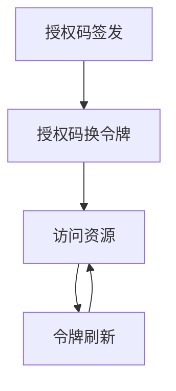

# 流程与功能对齐 — SaaS 身份平台SpringBoot后端

> 人填、人评审。机器只检查引用的功能 ID 是否存在。
> 评审时把流程图投出来，逐行念「这一步靠哪些功能完成」。念不出来的行，
> 要么流程是空的，要么功能是缺的。这就是对齐的全部意义。

## FLOW-OAUTH-01 授权码三步流转（v0.2.0 Phase 6 真 OAuth IdP）

> 资源方应用（如 lab 后端）作为 OAuth client 接入 saas IdP 的标准授权码流程。

| 步骤 | 名称 | 角色 | 输入 | 输出 | 状态流转 | 支撑功能子项 |
|---|---|---|---|---|---|---|
| S01 | 授权码签发 | 资源方应用（client） | client_id / redirect_uri / scopes / 用户会话 | saas-code-{ts}-{rand}（TTL 10min，落 oauth_codes） | code: issued → consumed | M04.F02.I06 |
| S02 | 授权码换令牌 | 资源方应用 | code + client 凭据 + redirect_uri | access token（HS256 JwtIssuer）+ refresh_token（TTL 7d） | code: issued → consumed; refresh: active | M04.F02.I07 |
| S03 | 访问资源 | 资源方应用 | Bearer access token | 资源方本地校验后的业务响应 | — | （资源方仓条目） |
| S04 | 令牌刷新 | 资源方应用 | refresh_token | 新 access + 新 refresh（旋转换发） | refresh: old → consumed, new → active | M04.F02.I08 |

### 评审时问这四个问题

1. 有没有哪个步骤的「支撑功能子项」是空的？→ 功能缺失，或这一步不该存在
2. 有没有功能子项从头到尾没出现在任何流程里？→ 见下方孤儿清单
3. 状态流转列里的状态名，和代码里的枚举一致吗？→ 不一致就是两套真相
4. 退回路径都画了吗？→ 只画正向流程，会漏掉一半功能

### 孤儿功能

| 子项 ID | 名称 | 类型 | 已上线原因（不在流程图） |
|---|---|---|---|
| M01.F01.I02 | 创建用户（POST /tenants/:t/users，TenantUserMapper status='active' 默认） | 接口 | 跨端契约对齐 oracle（saas-msw）+ 共享 PG 真后端；当前无 UI 入口（与 INVITED 路径 /users/invitations 并存） |
| M05.F01.I05 | 物理删 API Key（DELETE /tenants/:t/api-keys/:k，幂等返 204 / 404） | 接口 | 跨端契约对齐 oracle；与 I03 revoke 软删并存；admin 工具化操作 |
| M09.F03.I02 | 角色授权菜单 ID 查询（membership.roleIds → role_menu_grants.menuIds） | 接口 | GET /me/menus 装配链路第一步；不独立暴露，归属 M09.F03 「当前用户有效菜单」装配流程 |
| M09.F03.I03 | 菜单树装配（menuIds → menus 表 + 父链补全） | 接口 | GET /me/menus 装配链路第二步；同上 |
| M09.F03.I04 | app 分组映射（按 app.code 输出 Map<appCode, List<EffectiveMenuNode>>） | 接口 | GET /me/menus 装配链路第三步；同上 |

（本批次 FLOW-OAUTH-01 登记的 M04.F02.I06-I08 均已归入授权码流程。）
