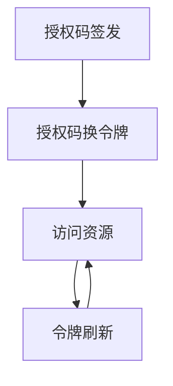
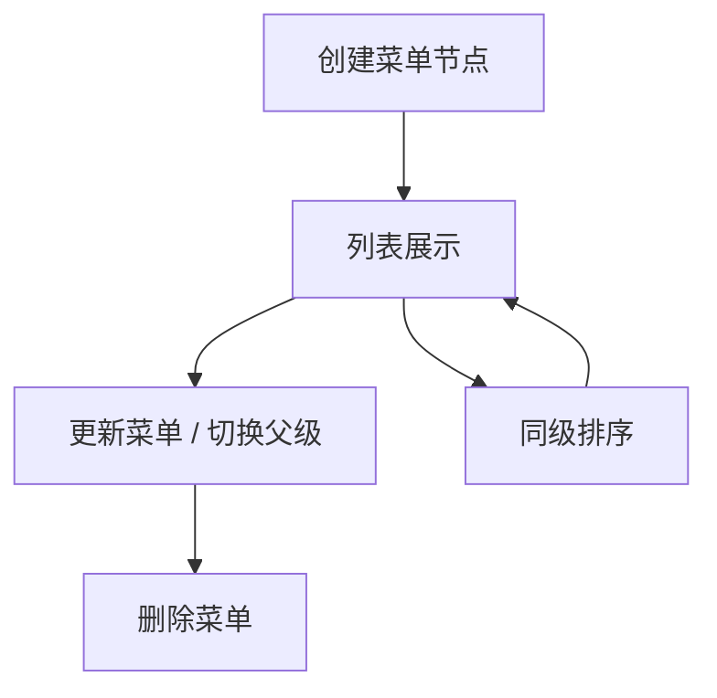
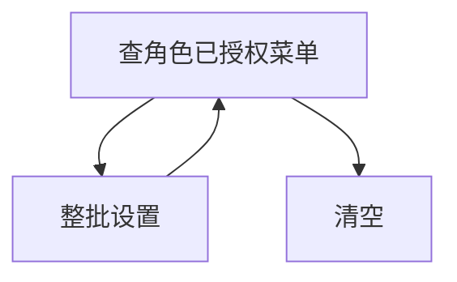

# 流程与功能对齐 — SaaS 身份平台SpringBoot后端 （已废段镜像豁免，9/7 迁移前快照）

> 人填、人评审。机器只检查引用的功能 ID 是否存在。
> 评审时把流程图投出来，逐行念「这一步靠哪些功能完成」。念不出来的行，
> 要么流程是空的，要么功能是缺的。这就是对齐的全部意义。

## FLOW-OAUTH-01 授权码三步流转（v0.2.0 Phase 6 真 OAuth IdP）

> 资源方应用（如 lab 后端）作为 OAuth client 接入 saas IdP 的标准授权码流程。

```mermaid
flowchart TD
    S01[授权码签发] --> S02[授权码换令牌]
    S02 --> S03[访问资源]
    S03 --> S04[令牌刷新]
    S04 --> S03
```

| 步骤 | 名称 | 角色 | 输入 | 输出 | 状态流转 | 支撑功能子项 |
|---|---|---|---|---|---|---|
| S01 | 授权码签发 | 资源方应用（client） | client_id / redirect_uri / scopes / 用户会话 | saas-code-{ts}-{rand}（TTL 10min，落 oauth_codes） | code: issued → consumed | M04.F03.I01 |
| S02 | 授权码换令牌 | 资源方应用 | code + client 凭据 + redirect_uri | access token（HS256 JwtIssuer）+ refresh_token（TTL 7d） | code: issued → consumed; refresh: active | M04.F03.I02 |
| S03 | 访问资源 | 资源方应用 | Bearer access token | 资源方本地校验后的业务响应 | — | （资源方仓条目） |
| S04 | 令牌刷新 | 资源方应用 | refresh_token | 新 access + 新 refresh（旋转换发） | refresh: old → consumed, new → active | M04.F03.I03 |

### 评审时问这四个问题

1. 有没有哪个步骤的「支撑功能子项」是空的？→ 功能缺失，或这一步不该存在
2. 有没有功能子项从头到尾没出现在任何流程里？→ 见下方孤儿清单
3. 状态流转列里的状态名，和代码里的枚举一致吗？→ 不一致就是两套真相
4. 退回路径都画了吗？→ 只画正向流程，会漏掉一半功能

## FLOW-MENU-01 平台级菜单 CRUD 与结构维护（v0.2.x，NSwag codegen from shared tsp routes/admin-app-menus.tsp）

> 平台 admin 在某 OAuth 应用（appId）下增删改菜单节点，并维护节点之间的父链 / 排序。

```mermaid
flowchart TD
    M1[创建菜单节点] --> M2[列表展示]
    M2 --> M3[更新菜单 / 切换父级]
    M2 --> M4[同级排序]
    M3 --> M5[删除菜单]
    M4 --> M2
```

| 步骤 | 名称 | 角色 | 输入 | 输出 | 状态流转 | 支撑功能子项 |
|---|---|---|---|---|---|---|
| M1 | 创建菜单节点 | 平台 admin | appId + Menu payload | 新 Menu 记录（status=active） | — | M08.F01.I02 |
| M2 | 列表展示 | 平台 admin | appId | Menu[]（扁平列表，前端按 parentId 自构树） | — | M08.F01.I01 |
| M3 | 更新菜单 / 切换父级 | 平台 admin | menuId + patch / {parentId} | 更新后的 Menu | — | M08.F01.I04 / M08.F02.I07 |
| M4 | 同级排序 | 平台 admin | menuId + ReorderMenuRequest（menuIds 数组） | sortOrder 更新后的 Menu[] | — | M08.F02.I06 |
| M5 | 删除菜单 | 平台 admin | menuId | 204 / 404 | menus.DELETE | M08.F01.I05 |

## FLOW-ROLE-MENU-01 角色 ↔ 菜单 授权读写（v0.2.x，NSwag codegen from shared tsp routes/tenant-role-menus.tsp）

> tenant admin 在某角色下整批设置 / 查询 / 清空菜单授权。

```mermaid
flowchart TD
    R1[查角色已授权菜单] --> R2[整批设置]
    R2 --> R1
    R1 --> R3[清空]
```

| 步骤 | 名称 | 角色 | 输入 | 输出 | 状态流转 | 支撑功能子项 |
|---|---|---|---|---|---|---|
| R1 | 查角色已授权菜单 | tenant admin | roleId | RoleMenuGrant{roleId,tenantId,menuIds,updatedAt} | — | M09.F01.I01 |
| R2 | 整批设置 | tenant admin | roleId + SetRoleMenusRequest{menuIds:[]} | RoleMenuGrant（UPSERT 整批替换） | role_menu_grants: 旧 menuIds → 新 menuIds | M00.F04.I03 |
| R3 | 清空 | tenant admin | roleId | 204 | role_menu_grants.DELETE | M09.F02.I03 |
